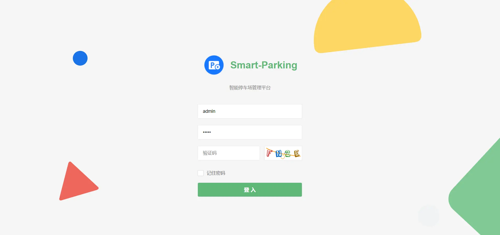
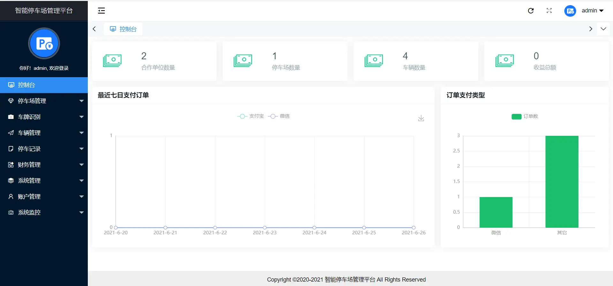
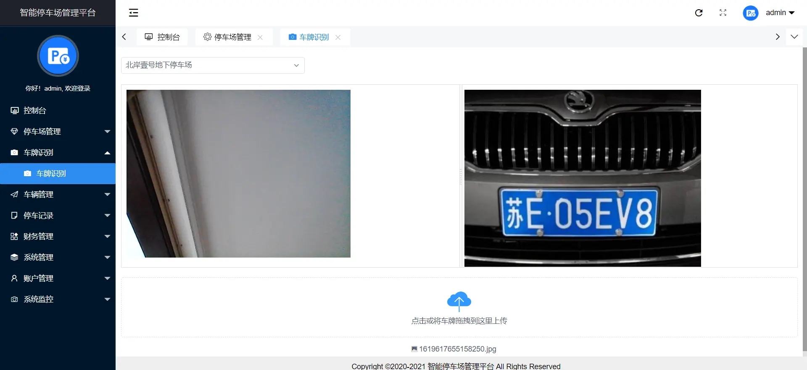
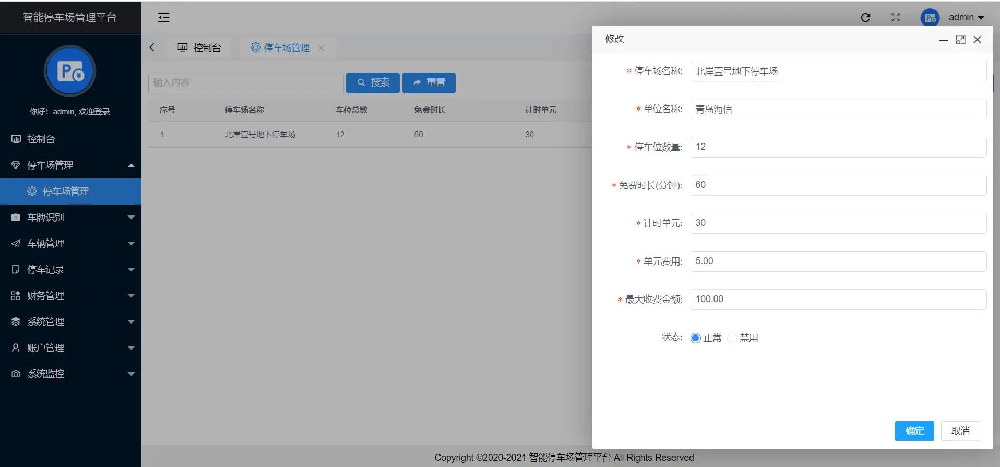
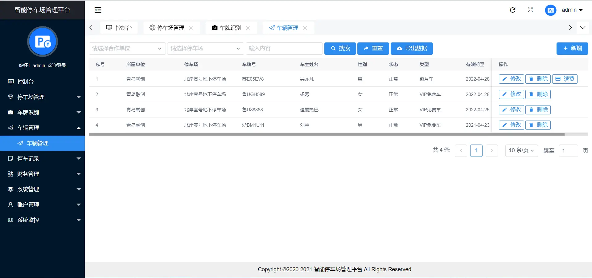
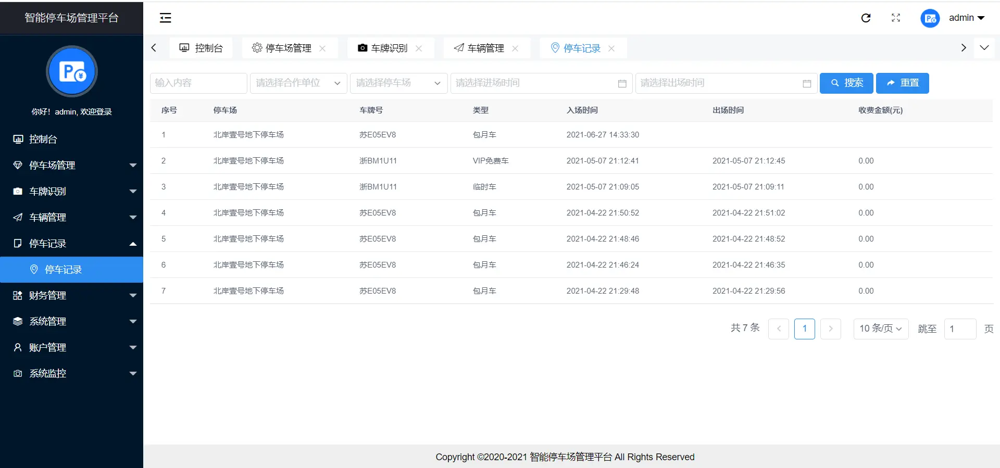
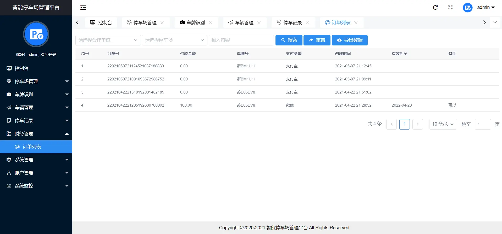
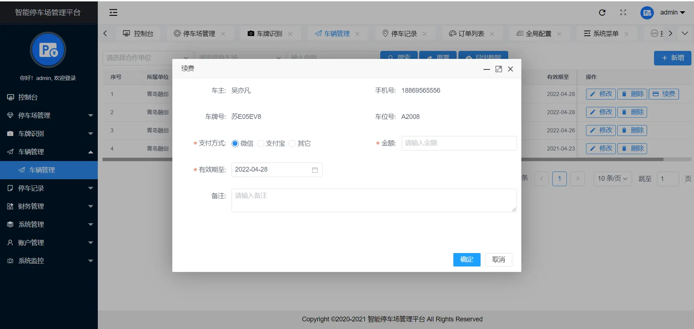
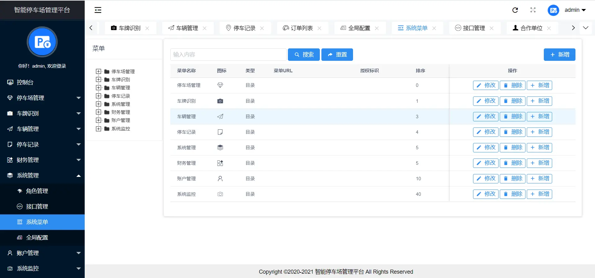

# 停车场管理

#### 介绍
停车场管理系统，车位管理系统，基于 SpringBoot + Vue 的智能停车场管理系统，号牌识别，车辆管理，角色管理、系统管理、账号管理等等，可以用来当作毕业设计或者课程设计。

#### 基础环境
JDK1.8、Maven、Mysql、IntelliJ IDEA、payCloud

#### 功能介绍

系统管理：角色管理、接口管理、系统菜单、全局配置

账号管理：用户管理、合作单位

系统监控：监控大屏、日志监控

财务管理：订单列表

停车记录：停车记录

车辆管理：车辆管理

车牌识别：车牌识别

停车场管理：停车场管理

#### 截图

### 联系我
 可以帮忙有偿部署、技术咨询、毕设、课设定制等等，欢迎骚扰 vx：xtb365
